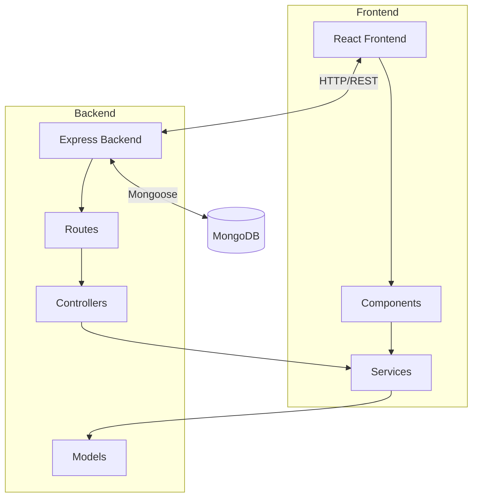

# Project Architecture

## Overview
The Sales Management System is a full-stack web application designed to manage and visualize sales data. It consists of a React-based frontend for the user interface and a Node.js/Express backend for data processing and storage.

## Technology Stack

### Frontend
- **Framework**: React (Vite)
- **Styling**: Custom CSS (Modular)
- **State Management**: React Hooks (useState, useEffect)
- **HTTP Client**: Axios

### Backend
- **Runtime**: Node.js
- **Framework**: Express.js
- **Database**: MongoDB
- **ODM**: Mongoose
- **Data Processing**: CSV Parser (for initial data migration)

## Architecture Diagram



## Directory Structure

```
root/
├── backend/                 # Backend Application
│   ├── src/
│   │   ├── config/         # Database configuration
│   │   ├── controllers/    # Request handlers
│   │   ├── models/         # Mongoose schemas
│   │   ├── routes/         # API routes
│   │   ├── services/       # Business logic
│   │   └── utils/          # Utility functions
│   ├── scripts/            # Data seeding scripts
│   └── data/               # Raw data files (CSV)
│
├── frontend/               # Frontend Application
│   ├── src/
│   │   ├── components/     # Reusable UI components
│   │   ├── services/       # API integration
│   │   ├── styles/         # CSS files
│   │   ├── App.jsx         # Main application component
│   │   └── main.jsx        # Entry point
│   └── public/             # Static assets
│
└── docs/                   # Documentation
    └── architecture.md     # This file
```

## Data Flow

1.  **Data Ingestion**: Raw sales data is imported from CSV files using the `seedData.js` script.
2.  **Storage**: Data is stored in MongoDB with optimized indexes for querying.
3.  **API Layer**: The Express backend exposes RESTful endpoints to fetch, filter, and aggregate data.
4.  **Presentation**: The React frontend consumes the API, managing local state for filters and pagination, and rendering the data in interactive tables and charts.

## Key Features

-   **Scalable Data Handling**: Backend supports pagination and efficient MongoDB queries for large datasets (1M+ records).
-   **Real-time Aggregation**: On-the-fly calculation of total units, amounts, and discounts based on active filters.
-   **Responsive UI**: Custom-styled components including a Sidebar, Filter Panel, and Data Table.
